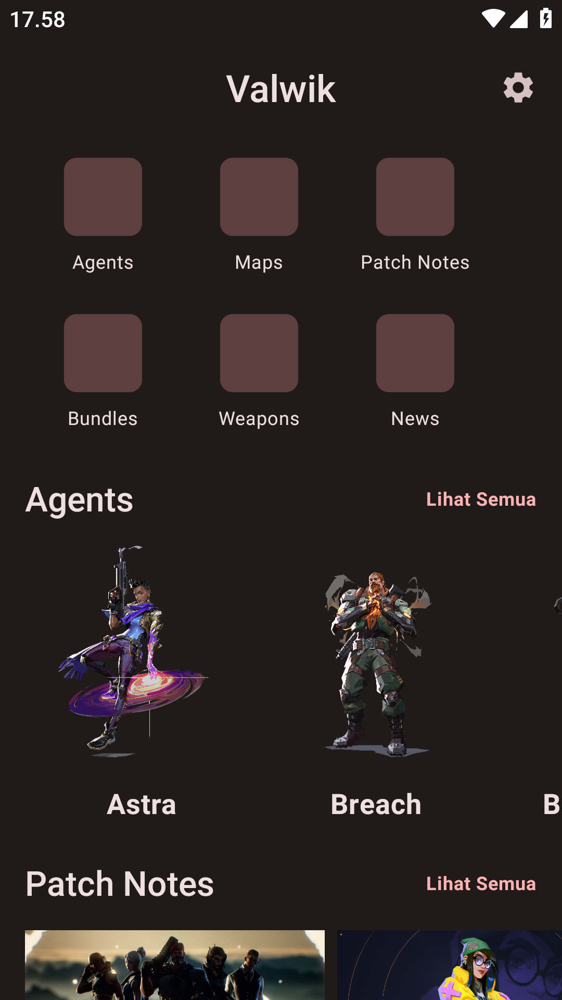

    <h1>Valwik</h1>
    
An Android application for Valorant Wikipedia

---

  
  
  
  

## Features
- Home Screen
- List Maps
- List Agents
- List Game Updates
- List Weapons
- List Bundles
- Appearance (`Default`, `Dark`, `PureBlack`)

## Library
1. [Hilt](https://dagger.dev/hilt/) for Dependency Injection
2. [Coil-Compose](https://coil-kt.github.io/coil/compose/) for Image Loader
3. [Ktor-Client](https://ktor.io/docs/getting-started-ktor-client.html#create-client) for HTTP Client
4. [DataStore](https://developer.android.com/topic/libraries/architecture/datastore) for New version of [SharedPreferences](https://developer.android.com/training/data-storage/shared-preferences)
5. [Compose Destinations](https://github.com/raamcosta/compose-destinations) for Compose Navigation
6. Used AndroidX, Jetpack Compose, Material Design Components 3, ViewModel, and any more libraries

## Data Source
- [Valorant-API](https://valorant-api.com/)
- [Unofficial VALORANT API](https://docs.henrikdev.xyz/)

## Disclaimer
This project and its contents are not affiliated with, funded, authorized, endorsed by, or in any way associated with Riot Games, Valorant or any of its affiliates and subsidiaries.

Any trademark, service mark, trade name, or other intellectual property rights used in this project are owned by the respective owners.

